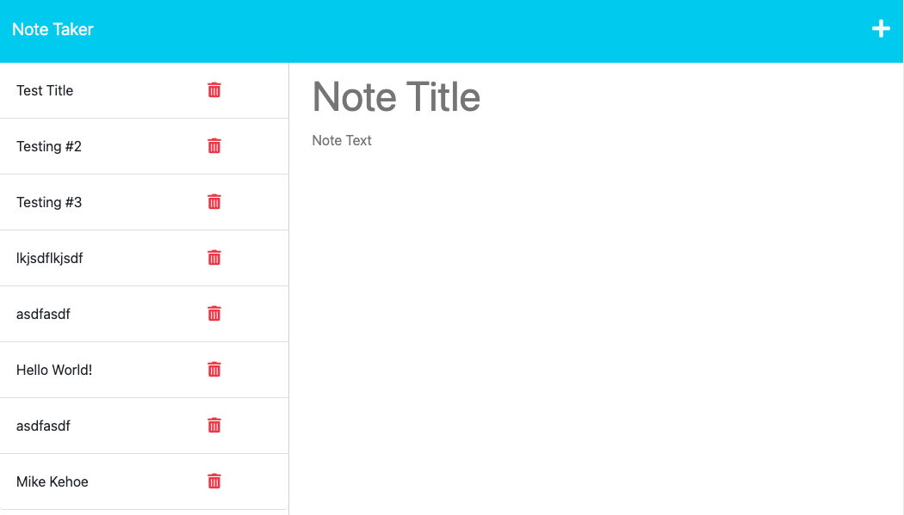

# 11 Express.js: Note Taker

## Description
Note Taker is a web application that allows users to write and save notes. It uses Express.js on the back end to handle HTTP requests and stores note data in a JSON file. With Note Taker, you can create, view, and delete notes easily.

## Table of Contents
* [Installation](#installation)
* [Usage](#usage)
* [Credits](#credits)
* [License](#license)

## Installation
- Clone the repository, then navigate to the project directory.
- To install necessary dependencies, run the following command:
```
npm i
```
## Usage


Visit the live website at this link:
https://mk-express-note-taker.herokuapp.com/

- To run the application, run the following command:
```
npm start
```
- Open the application in your browser at the following URL:
```
http://localhost:3002
```
- Click on the "Get Started" button to begin creating and saving notes.

- Enter a title and text content for your note, then click the save icon to save the note.

## Credits
Node.js
https://nodejs.org/en/

Express.js https://expressjs.com/

Heroku https://www.heroku.com/

## License
Please refer to the LICENSE in the repo.